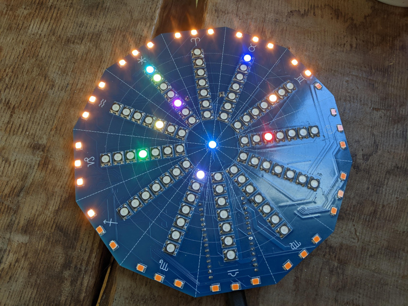

# Astro Medallion

Electronics schematics, PCB layout, and software for the Astro Medallion.

The Astro Medallion is a 12 sided circuit board with LEDs that represent the astrological planets and their positions as a sort of clock. Earth is in the middle of 12 spokes of addressable RGB LEDs, where each spoke represents a sky position in the elliptical - each 30 degree section one of the zodiac signs. The distance along each spoke represents the distance away from the each planet is from the earth. Since it's geocentric planets may sometimes be closer or farther away from each other. Each planet will have a unique color.

There are Warm White LEDs along the edge of the PCB which represents the current field of view from your position on Earth - which rotates around the board once every 24 hours.

The project is a kind of translation of this page: https://ericofftherails.city/astrosim/

The LEDs are controlled by an esp32c3 microcontroller on a development board.

# Software

Fundamentally, the software controlling the board needs to:
1. Read the time in the RTC (Real Time Clock) chip on the PCB
2. Calculate Planetary positions
   1. Compute the positions of the planets relative to the earth based on the current time
   2. Compute the "facing" horizon position
3. Update the Display
   1. Send color data to the Addressable LEDs representing where each Planet is with respect to the zodiac sign
   2. Send white LED data representing the current horizon position
4. Sleep, and then awaken in time for the next update

Additionally, the software will have to be configurable mainly in setting the current time. Reading and Writing the current time will go over I2C to the RTC chip on board. This perhaps could be accomplished with a basic serial command line

